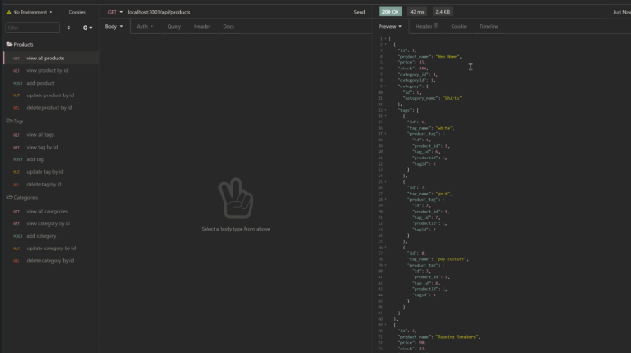

# Ecommerce Backend

The Ecommerce Backend application allows a user to manage products, categories, and tags for their online business. Powered by MySql and Sequelize, data is stored and easily accessible in one database.

## Table of Contents
[Features](#Features)

[Installation/Connection](#Installation/Connection)

[Usage](#Usage)

[Demo](#Demo)

[Questions](#Questions)

[License](#License)

## Features
* Connect to MySql database and seed application via command prompts.
* View all products, tags, and categories, as well as associated data from other tables.
* View specific products, tags, and categories by ID.
* Create, edit, and delete table rows and child elements.

## Installation/Connection
* Run npm install to get all dependencies
* Complete .env file with credentials
* From command prompt:
  * Login to MySql, then

        source db/schema.sql
        quit
        npm run seed
        npm run start

## Usage
From Insomnia Core, request API routes to view, add, edit, and delete data.

## Demo
To view a video walkthrough, play:

## Questions
Don't hesitate to reach out 
  * Github Username: ShaylaStevenson
  * [View Github Profile](https://github.com/ShaylaStevenson)
  * [View Project Repository](https://github.com/ShaylaStevenson/Ecom-BackEnd)
  * Email: shayla.rose.stevenson@gmail.com

  ## License
This project is licensed under the terms of the MIT license. View license at:
https://opensource.org/licenses/MIT.
  